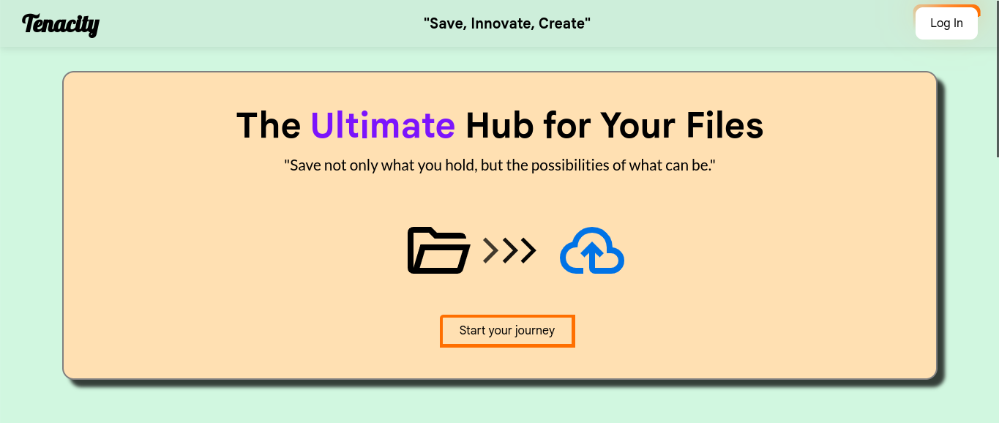

# 📁 **Tenacity**

## 🚀 **Overview**
Welcome to **Tenacity** — the ultimate platform for secure and efficient file saving and management. Whether you're organizing personal documents or collaborating on professional projects, our platform ensures seamless file handling with intuitive user experiences.

## 🌟 **Key Features**
- **Secure File Storage:** Store your files with industry-standard encryption.
- **Easy File Management:** Organize, search, and access your files effortlessly.
- **Cross-Platform Access:** Use the platform from any device.
- **Real-Time Sync:** Automatic synchronization across devices.
- **User-Friendly Interface:** Clean and minimal design for a better experience.

## 💻 **Technology Stack**
- **Frontend:** HTML, CSS, JavaScript
- **Backend:** Flask (Python)
- **Database:** MySQL
- **Hosting:** [Rasberry Pi 4]

## 📸 **Screenshots**


## 🛠️ **Installation**
1. Clone the repository:
```bash
git clone https://github.com/Odiedo123/Tenacity.git
```
2. Run the Flask server:
```bash
flask run
```
3. Access the app at `http://127.0.0.1:5000`

## 🌐 **Live Demo**
Check out the live version: [Work in Progress]

## 👤 **User Authentication**
- **Sign Up / Login:** Users can create accounts and securely log in.
- **Session Management:** Session-based user authentication.

## 📚 **Documentation**
For more details, check the full documentation [here](#).

## 🤝 **Contributing**
1. Fork the repository.
2. Create a new branch:
```bash
git checkout -b feature-branch
```
3. Commit your changes:
```bash
git commit -m 'Add new feature'
```
4. Push to the branch:
```bash
git push origin feature-branch
```
5. Open a pull request.

## 📧 **Contact**
- **Email:** [odiedo12345@gmail.com]
- **LinkedIn:** [Odiedo123]
- **GitHub:** [Odiedo123]

## 📝 **License**
This project is licensed under the [MIT License](LICENSE).

---
_Thank you for using **Tenacity**! Feel free to share feedback or contribute to make it even better._


